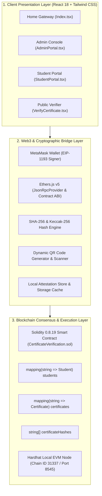
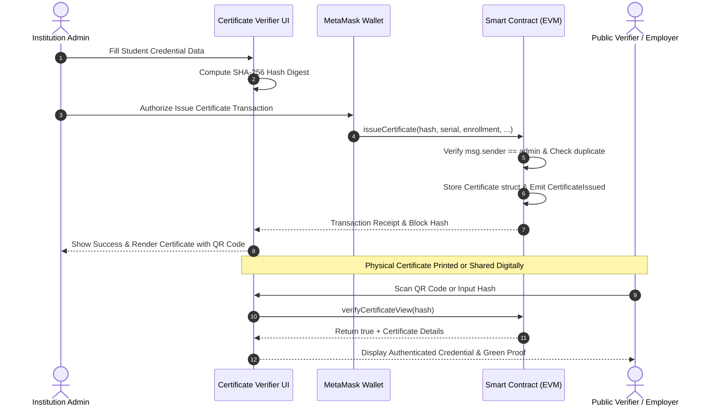

# 🏗️ System Architecture & Engineering Blueprint

This document details the high-level system architecture, data models, smart contract state machine, and cryptographic validation pipeline of the **Certificate Verifier** platform.

---

## 1. High-Level Architectural Layers



---

## 2. Layer Descriptions

### 1. Client Presentation Layer
- **Framework**: React 18 with TypeScript and Vite 5.
- **Styling & Design System**: Tailwind CSS 3.4 featuring a custom HSL token architecture supporting seamless **Light** and **Dark** theme switching.
- **Portals**:
  - **Public Verification**: Zero-auth public access for instant cryptographic verification via Hash string, URL query, or QR code upload.
  - **Student Portal**: Student access via institutional enrollment number & secret password. Provides credential downloads and verification links.
  - **Admin Console**: Restricted authority console authenticated via the deployer's MetaMask wallet for student onboarding and certificate minting.

### 2. Web3 & Cryptographic Bridge Layer
- **Ethers.js v5**: Connects the frontend to the Ethereum virtual machine. Manages JSON-RPC requests, transaction construction, gas estimation, and ABI encoding/decoding.
- **MetaMask Provider**: Provides hardware-isolated cryptographic key storage. Signs state-modifying transactions (e.g. `issueCertificate`, `registerStudent`).
- **Cryptographic Digest Engine**: Generates a deterministic SHA-256 digest binding the student's enrollment number, name, course, institution, and issue timestamp.
- **Dual-Mode Attestation**: When operating offline or in evaluator demo mode, the client gracefully syncs with local storage caches to demonstrate full verification flows without RPC timeouts.

### 3. Blockchain Execution Layer
- **Solidity Contract (`CertificateVerification.sol`)**:
  - Compiler: `v0.8.19`.
  - State Management: Uses gas-optimized storage slots with O(1) hash lookups.
  - Role-Based Access Control: `onlyAdmin` modifier restricts issuance to the verified institution address.
  - Immutability: Once a certificate hash is recorded in `certificates[hash]`, its state cannot be altered or overwritten.

---

## 3. Data Models & Structures

### Certificate Struct (Solidity & TypeScript)
```solidity
struct Certificate {
    string certificateNumber; // Unique serial (e.g., CERT-2024-0042)
    string studentName;       // Full legal name of recipient
    string enrollmentNumber;  // Academic student ID
    string course;            // Conferred degree/program
    string institution;       // Issuing academic university
    uint256 issueYear;        // Graduation calendar year
    uint256 issueDate;        // Unix epoch timestamp of issuance
    string ipfsHash;          // Optional IPFS multihash or document CID
    address issuerAddress;    // Ethereum address of issuing administrator
}
```

### Student Struct (Solidity & TypeScript)
```solidity
struct Student {
    string name;              // Student legal name
    string email;             // Official academic email
    string mobileNumber;      // Contact telephone
    string department;        // Faculty/Department (e.g., Computer Engineering)
    string batchYear;         // Cohort academic years (e.g., 2020-2024)
    bool isRegistered;        // Boolean registration flag
    uint256 registrationDate; // Unix epoch timestamp of onboarding
}
```

---

## 4. End-to-End Cryptographic Sequence Flow



---

## 5. Collision Resistance & Security Invariants

1. **Pre-image Resistance**: Given a certificate hash `H`, it is computationally infeasible to find inputs `(student, course, date)` that produce `H`.
2. **Duplicate Prevention**: The smart contract verifies that `isCertificateNumberExists(serial)` is false before committing state.
3. **Ledger Immutability**: No revocation or modification can alter an existing transaction's cryptographic presence within confirmed Ethereum blocks.
