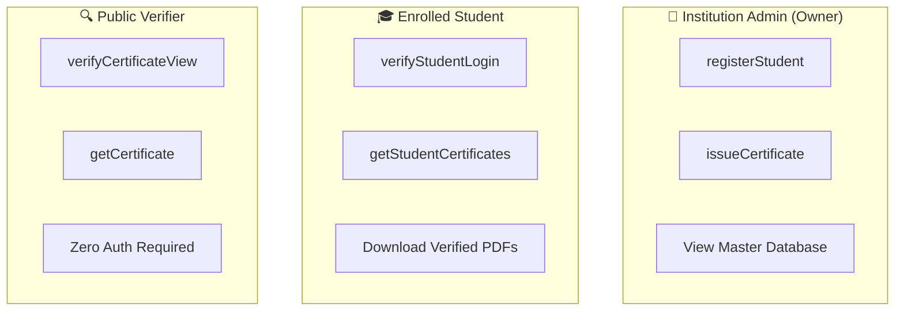

# 🔒 Security Model & Cryptographic Guarantees

This document details the threat model, cryptographic proofs, access control invariants, and fraud mitigation strategies implemented in **Certificate Verifier**.

---

## 1. Threat Landscape & Mitigations

| Threat Vector | Attack Scenario | Certificate Verifier Mitigation |
| :--- | :--- | :--- |
| **Forged Paper Diplomas** | Fraudster prints physical diploma with altered student name or CGPA. | The physical certificate contains a dynamic QR code leading to its verified on-chain record. Any altered text does not match the blockchain hash. |
| **Database Tampering** | Insider modifies grades in a centralized university SQL database. | Records are committed to the decentralized Ethereum blockchain. The state is immutable and tamper-evident; no database administrator can rewrite history. |
| **Unauthorized Issuance** | Bad actor attempts to mint certificates for unapproved candidates. | The smart contract's `issueCertificate` function is guarded by an `onlyAdmin` modifier checking `msg.sender == admin`. Only the verified private key can issue. |
| **Certificate Serial Replay** | Attacker tries to reuse a valid certificate number for another student. | The smart contract checks `isCertificateNumberExists(serial) == false`. Duplicate issuance reverts immediately with an error. |
| **MITM Verification Hijacking** | Network interceptor attempts to falsify verification responses. | Verification checks are performed directly against Ethereum JSON-RPC nodes with signed cryptographic state proofs. |

---

## 2. Cryptographic Hash Derivation

The unique fingerprint of each certificate is computed deterministically using standard **SHA-256**:

```
Payload = EnrollmentNumber + "||" + StudentName + "||" + Course + "||" + Institution + "||" + IssueYear + "||" + Timestamp
CertificateHash = "0x" + SHA256(Payload)
```

### Invariants:
1. **Determinism**: The same certificate payload will always produce the identical 64-character hexadecimal digest.
2. **Avalanche Effect**: Modifying even a single character in the student's name (e.g., from `Aarav` to `Arav`) completely scrambles the output hash, failing verification instantly.
3. **Collision Resistance**: Finding two different certificate records that produce the same SHA-256 hash requires $2^{128}$ operations, making deliberate collisions computationally impossible.

---

## 3. Role-Based Access Control (RBAC)

The system enforces three distinct permission tiers:



- **Administrator**: Must be authenticated via the Ethereum private key that deployed the contract (`ADMIN_WALLET_ADDRESS`). Has exclusive rights to write new records.
- **Student**: Authenticated by comparing password hashes against student records registered by the admin. Read-only access to personal credentials.
- **Public Verifier**: Has unrestricted read-only access to query and verify any certificate hash or serial number on the blockchain.
